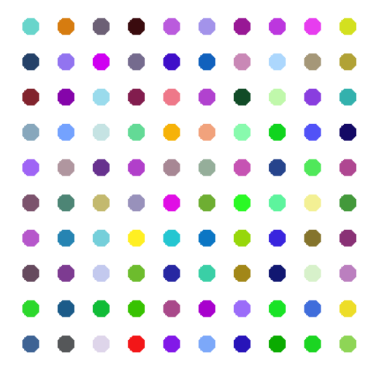
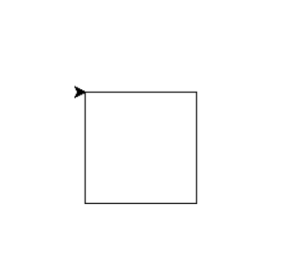
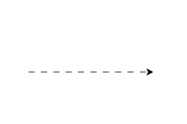
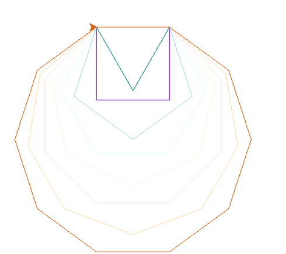
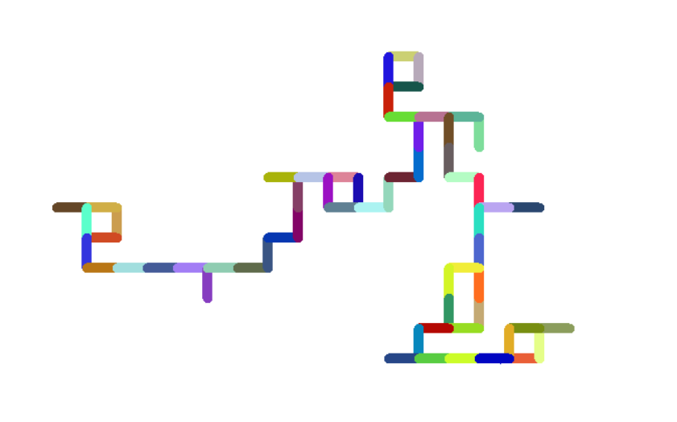
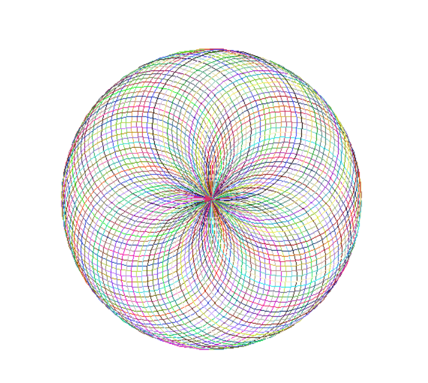

# The Hirst Painting Project 🎨

Este projeto recria uma obra de arte no estilo de **Damien Hirst**, utilizando a biblioteca `turtle` do Python para desenhar uma grade de pontos coloridos. Cada ponto é gerado com uma cor aleatória, criando um padrão vibrante e visualmente atrativo.

## O que foi aprendido:
- **Uso da biblioteca `turtle`:** Manipulação de gráficos 2D e controle do movimento de uma "tartaruga" para desenhar na tela.
- **Cores RGB:** Geração de cores aleatórias com a função `randint` e aplicação no desenho.
- **Manipulação de coordenadas:** Posicionamento preciso da "tartaruga" para criar uma grade de pontos organizados.
- **Funções personalizadas:** Criação de funções reutilizáveis, como `random_color`, para modularizar o código.

## O que o código faz:
1. **Configuração inicial:** Define a posição inicial da "tartaruga" para o canto inferior esquerdo da tela.
2. **Geração de cores aleatórias:** Cria cores RGB aleatórias para cada ponto.
3. **Desenho em grade:** Desenha 10 linhas e 10 colunas de pontos com espaçamento uniforme.
4. **Teletransporte da tartaruga:** Move a "tartaruga" para a próxima posição sem deixar rastros.
5. **Interação com o usuário:** O programa exibe a arte final até que o usuário clique na janela para fechá-la.

## Exemplo de execução
- `main.py`:

### Desafios extras
- `challenge_1.py`:

- `challenge_2.py`:

- `challenge_3.py`:

- `challenge_4.py`:

- `challenge_5.py`:
