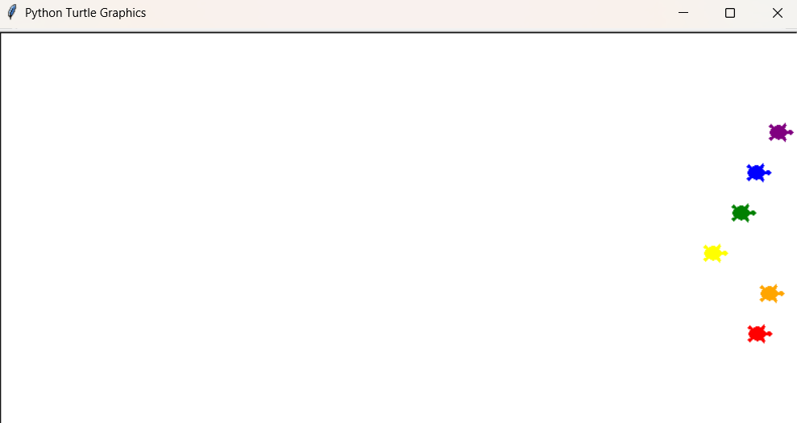

# The Turtle Race 🐢🏁

Este projeto cria uma corrida de tartarugas utilizando a biblioteca `turtle` do Python. Cada tartaruga tem sua própria cor, e o usuário pode tentar adivinhar qual tartaruga irá vencer ao apostar na cor correta.

## O que foi aprendido:
- **Uso da biblioteca `turtle`:** Utilização de Classes e Métodos.
- **Criação de múltiplos objetos:** Criação de múltiplas tartarugas através de um loop.
- **Dicionários:** Criação e manipulação de um dicionário.

## O que o código faz:
1. **Definir o tamanho da tela:** Para maior controle, foi definido uo tamanho da tela.
2. **Criação das tartarugas:** Dentro de um loop `for`, são criadas 6 objetos de tartarugas com diferentes cores e adicionas em um dicionário, com a cor sendo a chave, e o objeto o valor.
3. **Aposta:** Pede ao usuário para tentar adivinhar qual tartaruga será a vencedora.
4. **Corrida:** Dentro de um loop `while`, move as tartarugas por distâncias aleatórias até uma delas cruzar a linha de chegada e vencer a corrida.

## Exemplo de execução:
- `main.py`:
Neste exemplo de execução a tartaruga vencedora foi a Roxa (purple).
