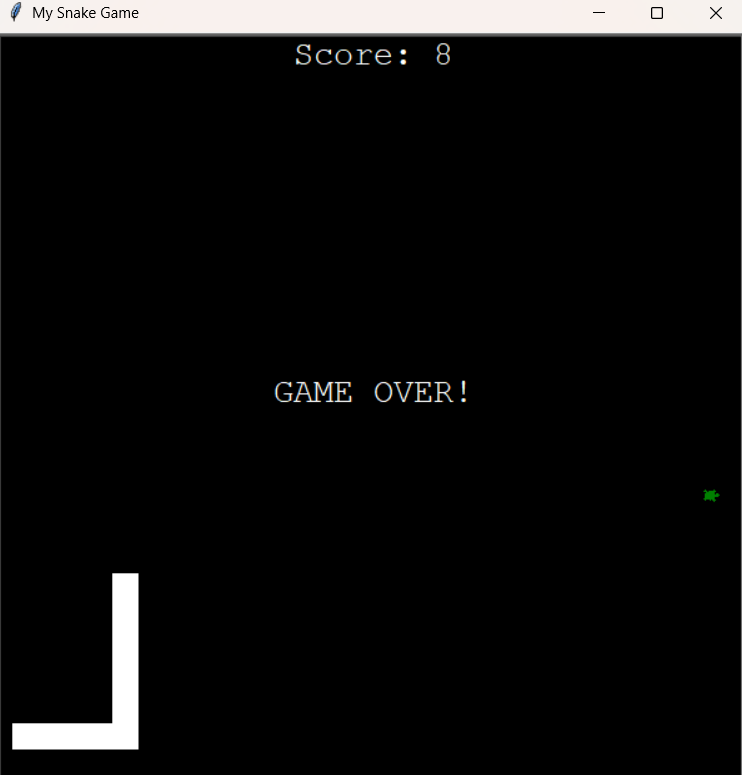

# My Snake Game 🐍 (parte Final)

Este projeto é uma recriação do clássico jogo da **Cobrinha**, desenvolvido em Python utilizando a biblioteca `turtle`. O jogo desafia o jogador a controlar a cobra para coletar alimentos e crescer, enquanto evita colisões com as bordas e o próprio corpo.

## O que foi aprendido:
- **Uso da biblioteca `turtle`:** Manipulação de gráficos 2D e controle de movimento para criar os elementos visuais do jogo.
- **Herança de classes:** Extensão das funcionalidades da classe `Turtle` para criar objetos personalizados, como `Food` e `Scoreboard`.
- **Manipulação de listas e tuplas:** Utilização de slicing para gerenciar os segmentos da cobra e suas posições.
- **Coordenação de eventos:** Configuração de listeners para capturar entradas do teclado e mover a cobra em diferentes direções.
- **Gerenciamento de estado do jogo:** Implementação de lógica para determinar o fim do jogo com base em colisões.

## O que o código faz:
1. **Configuração da tela:**
   - Cria uma tela de 600x600 pixels com fundo preto e título personalizado.
   - Utiliza o `tracer` para desativar atualizações automáticas da tela e proporcionar animações mais suaves.

2. **Objetos principais:**
   - **Cobra:** Uma lista de segmentos que se move continuamente para frente, com a capacidade de crescer ao comer alimentos.
   - **Alimento:** Um objeto que aparece em posições aleatórias e é consumido pela cobra.
   - **Placar:** Exibe a pontuação atual e mostra uma mensagem de "Game Over" quando o jogo termina.

3. **Lógica de movimento:**
   - A cobra é controlada pelas setas do teclado (cima, baixo, esquerda, direita).
   - Os segmentos da cobra seguem a posição do segmento anterior, criando um efeito de movimento fluido.

4. **Detecção de colisões:**
   - **Com o alimento:** A cobra cresce e a pontuação aumenta.
   - **Com as bordas:** O jogo termina se a cobra tocar nas extremidades da tela.
   - **Com o próprio corpo:** O jogo termina se a cobra colidir com um de seus próprios segmentos.

5. **Gravar o high score:**
   -  O high score é gravado em um arquivo `data.txt` para que continue mesmo após o jogador fechar a jogo.

6. **Finalização do jogo:**
   - O jogo permanece ativo até ocorrer uma colisão.
   - O jogador pode fechar a janela clicando nela.

## Como jogar:
1. Use as setas do teclado para mover a cobra.
2. Colete o alimento para aumentar sua pontuação e crescer.
3. Evite colidir com as bordas ou com o próprio corpo.
4. Divirta-se e tente bater seu recorde!

## Exemplo de execução:

