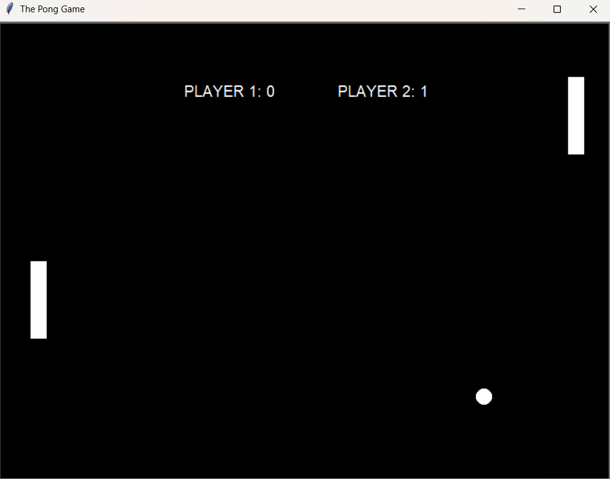

# Pong Game

Este projeto é uma recriação do clássico jogo Pong, desenvolvido em Python utilizando o módulo `turtle`. O objetivo do jogo é marcar 3 pontos antes do adversário, controlando as paletas para rebater a bola e impedir que ela passe.

## Aprendizado

Durante o desenvolvimento deste projeto, os seguintes conceitos foram reforçados:

- **Orientação a Objetos (OOP)**: Utilização de classes para organizar e encapsular funcionalidades, incluindo herança para criar objetos derivados de `Turtle`.
- **Manipulação do módulo Turtle**: Criação de objetos visuais, controle de movimento, e detecção de colisões.
- **Gerenciamento de eventos**: Configuração de listeners de teclado para interação em tempo real.
- **Controle de estados**: Implementação de variáveis para monitorar a pontuação e determinar as condições de vitória.
- **Animação e tempo**: Uso de `time.sleep` para controlar a velocidade da animação e suavizar os movimentos.

## Funcionalidades

- Controle das paletas:
  - Jogador 1: Teclas `w` (subir) e `s` (descer).
  - Jogador 2: Teclas `↑` (subir) e `↓` (descer).
- Aumenta a velocidade da bola a cada colisão com as paletas.
- Placar exibido na tela, atualizado em tempo real.
- Mensagem de vitória ao alcançar 3 pontos.

## Demonstração

---

Divirta-se jogando Pong! 🎮
