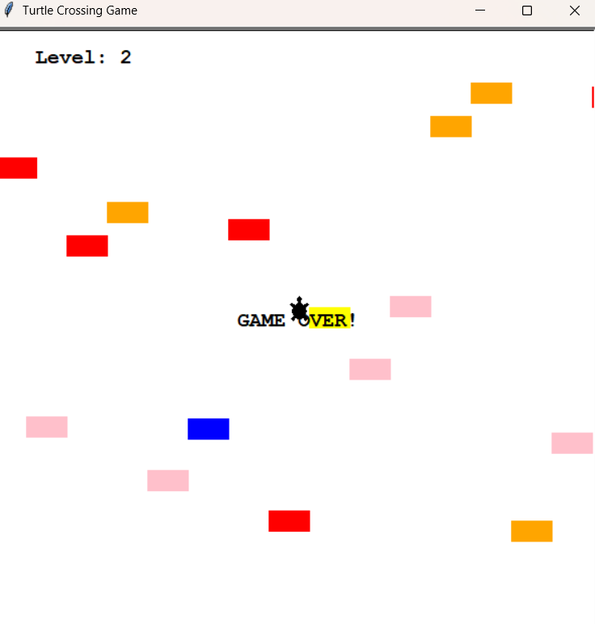

# Turtle Crossing Game

Este repositório contém o código-fonte do jogo **Turtle Crossing**, onde o jogador controla uma tartaruga tentando atravessar uma estrada movimentada sem ser atingida pelos carros. Cada nível aumenta a dificuldade, tornando o jogo progressivamente mais desafiador e divertido!

## Como Jogar
- Use a tecla **Up** para mover a tartaruga para cima.
- Evite colidir com os carros que passam.
- Alcance a linha de chegada para passar de nível.
- O jogo termina se a tartaruga colidir com um carro.

## Tecnologias Utilizadas
- **Python 3**: Linguagem principal do projeto.
- **Turtle Module**: Usado para gráficos e animações.
- **Random Module**: Gera posições e cores aleatórias para os carros.

## O Que Foi Aprendido
- **Orientação a Objetos**: Criação de classes como `Player`, `CarManager` e `Scoreboard`.
- **Herança**: Uso da herança ao estender a classe `Turtle`.
- **Controle de Tela**: Uso do módulo `turtle` para manipular objetos gráficos.
- **Loop Principal**: Implementação de loops e gerenciamento de eventos para criar um jogo fluido.
- **Interatividade**: Uso de eventos do teclado para controlar o jogo.

## Demonstração

---
Divirta-se jogando **Turtle Crossing** e explore o mundo da programação com Python! 🐢🚗