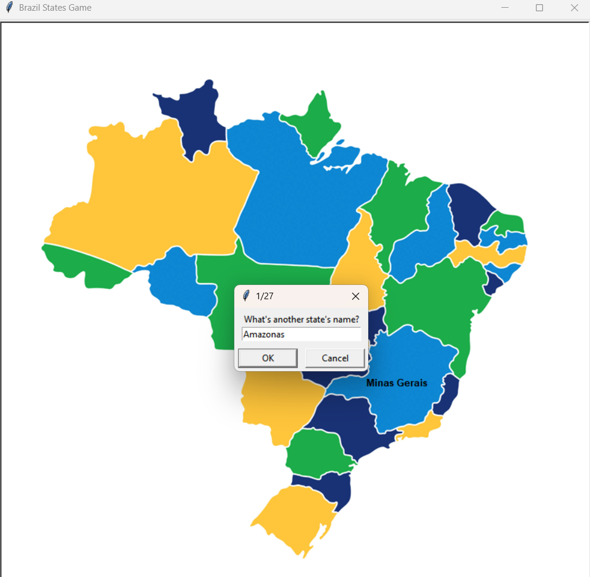

# Brazil States Quiz 💚💛💙

Este projeto é um jogo educativo desenvolvido em Python com a biblioteca `turtle` e `pandas`. O objetivo do jogo é testar os conhecimentos do jogador sobre os estados do Brasil, desafiando-o a nomear corretamente os estados e suas localizações no mapa.

## O que foi aprendido:
- **Manipulação de arquivos CSV com `pandas`** para extrair e utilizar dados geográficos dos estados brasileiros.
- **Uso da biblioteca `turtle`** para exibição gráfica dos estados no mapa.
- **Herança de classes em Python** para criar classes personalizadas como `State` e `Scoreboard`.
- **Verificação de entrada do usuário** para validar respostas e evitar repetições.
- **Gerenciamento de listas e condições** para registrar respostas corretas e checar a vitória.

## O que o código faz:
1. **Carregamento dos dados:**
   - Lê um arquivo CSV contendo os nomes dos estados brasileiros e suas coordenadas no mapa.

2. **Interação com o jogador:**
   - Solicita ao usuário que digite o nome de um estado brasileiro.
   - Valida se o nome do estado está correto e ainda não foi respondido.
   - Se a resposta for correta, o nome do estado é exibido no mapa.

3. **Gerenciamento de respostas:**
   - Adiciona o estado à lista de respostas corretas.
   - Impede que o jogador repita estados já respondidos.

4. **Verificação de vitória:**
   - O jogo verifica se todos os 27 estados foram nomeados corretamente.
   - Se todos forem encontrados, exibe uma mensagem de "Parabéns, você venceu!".

## Como jogar:
1. Digite o nome de um estado brasileiro quando solicitado.
2. Se a resposta estiver correta, o nome do estado aparecerá no mapa.
3. Continue até acertar todos os estados ou encerrar o jogo.

## Exemplo de execução:

