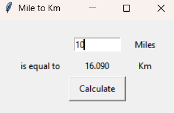

# Mile to Km Converter

Este projeto é um conversor de Milhas para Quilômetros desenvolvido com a biblioteca `Tkinter` em Python. Ele fornece uma interface gráfica simples onde o usuário pode inserir um valor em milhas e convertê-lo para quilômetros com um clique.

## O que foi aprendido:
- **Uso do Tkinter:** Construção de interfaces gráficas para aplicações desktop.
- **Manipulação de Widgets:** Utilização de `Label`, `Entry` e `Button` para exibir e capturar informações do usuário.
- **Layouts no Tkinter:** Organização de elementos usando `grid()` para posicionamento adequado.
- **Conversão de valores:** Transformação de milhas para quilômetros usando operações matemáticas básicas.

## O que o código faz:
1. **Criação da janela principal:**
   - Define um título e adiciona padding para um design mais espaçado.
   
2. **Widgets da interface:**
   - **Labels:** Exibem textos fixos como "is equal to", "Miles" e "Km".
   - **Entry:** Permite que o usuário insira um valor em milhas.
   - **Button:** Aciona a conversão ao ser pressionado.

3. **Lógica de conversão:**
   - Obtém o valor digitado pelo usuário.
   - Converte milhas para quilômetros multiplicando por `1.609`.
   - Exibe o resultado na interface gráfica.

4. **Execução da aplicação:**
   - A janela principal é mantida aberta com `mainloop()` até que o usuário a feche.

## Como usar:
1. Insira um valor no campo de entrada de "Miles".
2. Clique no botão "Calculate".
3. Veja o valor convertido para quilômetros ser exibido.

## Exemplo de execução:

