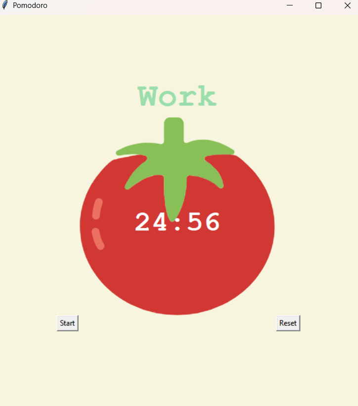

# Pomodoro Timer

Este projeto é um **Timer Pomodoro** desenvolvido com a biblioteca `Tkinter` em Python. Ele auxilia na gestão do tempo utilizando a técnica Pomodoro, alternando períodos de foco e descanso para aumentar a produtividade.

## O que foi aprendido:
- **Uso do Tkinter:** Construção de interfaces gráficas para aplicações desktop.
- **Manipulação de Widgets:** Utilização de `Label`, `Canvas`, `Button` e `PhotoImage` para exibir e capturar informações do usuário.
- **Gerenciamento de tempo:** Implementação de contadores regressivos e manipulação de eventos com `after()`.
- **Lógica de ciclos Pomodoro:** Alternância automática entre períodos de trabalho e descanso.

## O que o código faz:
1. **Criação da janela principal:**
   - Define um título e aplica um fundo colorido para melhor visualização.
   
2. **Widgets da interface:**
   - **Labels:** Exibem o status atual do timer (`Work`, `Break`) e os checkmarks indicando ciclos concluídos.
   - **Canvas:** Exibe a imagem do tomate e um texto atualizado com o tempo restante.
   - **Botões:** 
     - `Start`: Inicia o ciclo Pomodoro.
     - `Reset`: Reinicia o temporizador e apaga os checkmarks.

3. **Lógica do Timer Pomodoro:**
   - Conta o número de ciclos (`reps`) e alterna automaticamente entre períodos de **trabalho (25min)**, **pausas curtas (5min)** e **pausas longas (20min)**.
   - Exibe visualmente os checkmarks para cada ciclo de trabalho concluído.

4. **Execução da aplicação:**
   - A janela principal é mantida aberta com `mainloop()` até que o usuário a feche.

## Como usar:
1. Clique no botão **Start** para iniciar o Pomodoro.
2. O timer alternará entre períodos de trabalho e descanso.
3. Após cada ciclo de trabalho, um checkmark (`✔`) será adicionado.
4. Clique em **Reset** para reiniciar o temporizador.

## Exemplo de execução:

