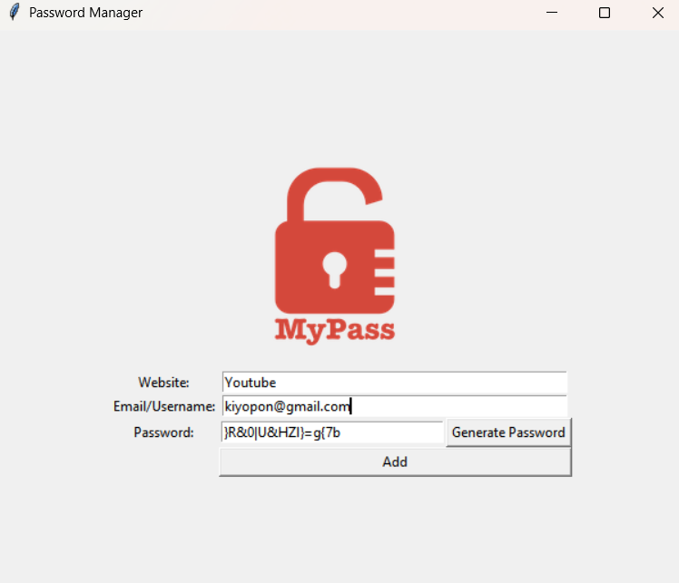

# Password Manager

Este projeto é um **Gerenciador de Senhas** desenvolvido com a biblioteca `Tkinter` em Python. Ele permite armazenar credenciais de sites de forma simples e segura, além de gerar senhas aleatórias para maior proteção.

## O que foi aprendido:
- **Uso do Tkinter:** Construção de interfaces gráficas para aplicações desktop.
- **Manipulação de Widgets:** Utilização de `Label`, `Entry`, `Button` e `Canvas`.
- **Manipulação de Arquivos:** Escrita de dados em arquivos `.txt` para armazenamento de credenciais.
- **Geração de Senhas Aleatórias:** Uso da biblioteca `random` para criar senhas seguras e únicas.

## O que o código faz:
1. **Criação da interface gráfica:**
   - Uma janela principal com campos para inserir site, e-mail/usuário e senha.
   - Um botão para gerar senhas aleatórias automaticamente.
   - Um botão para salvar as informações inseridas.

2. **Validação dos dados:**
   - Antes de salvar, verifica se todos os campos foram preenchidos.
   - Exibe mensagens de erro ou sucesso para o usuário.

3. **Geração automática de senhas:**
   - Cria senhas aleatórias de 16 caracteres contendo letras maiúsculas, minúsculas, números e símbolos.
   - Insere automaticamente a senha gerada no campo apropriado.

4. **Armazenamento das credenciais:**
   - Salva os dados inseridos no arquivo `information.txt`, permitindo consulta posterior.
   - Após o salvamento, os campos são limpos para novas entradas.

## Como usar:
1. Insira o nome do site no campo **Website**.
2. Digite o e-mail ou nome de usuário no campo **Email/Username**.
3. Clique em **Generate Password** para criar uma senha segura automaticamente ou insira uma manualmente.
4. Clique em **Add** para salvar as credenciais.
5. As informações serão armazenadas no arquivo `information.txt`.

## Exemplo de execução:

