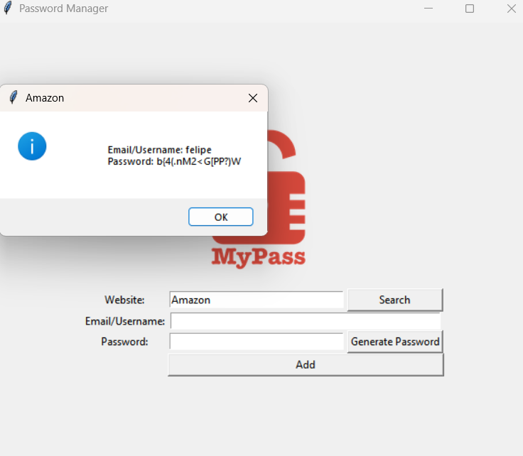

# Password Manager

Este é um gerenciador de senhas simples criado com Python e Tkinter. Ele permite salvar credenciais de login, gerar senhas seguras e pesquisar informações armazenadas.

## 📌 Tecnologias Utilizadas

- Python
- Tkinter (Interface gráfica)
- JSON (Armazenamento de dados)
- Random (Geração de senhas aleatórias)

## 📖 O que foi aprendido

- Manipulação de arquivos JSON para salvar e recuperar dados.
- Uso do Tkinter para criar interfaces gráficas interativas.
- Implementação de geração de senhas seguras com o módulo `random`.
- Tratamento de exceções para evitar erros ao lidar com arquivos.
- Uso de dicionários para organizar e armazenar dados de forma estruturada.

## 🚀 Funcionalidades

- **Salvar Credenciais**: Armazena informações de login (site, email/usuário e senha) em um arquivo JSON.
- **Gerar Senhas Aleatórias**: Cria senhas seguras automaticamente com 16 caracteres.
- **Pesquisar Credenciais**: Recupera informações de login com base no nome do site.
- **Interface Gráfica**: Desenvolvida com Tkinter para facilitar a interação do usuário.

## 📸 Exemplo de Execução

