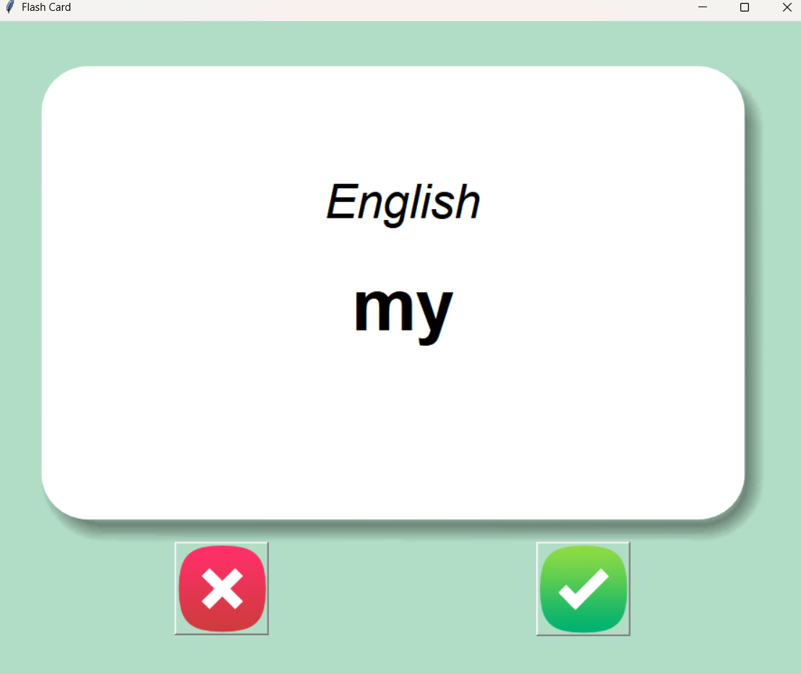

# 📖 Flashcards - Aprendizado de Inglês  

Este é um aplicativo simples de flashcards criado com Python e Tkinter. Ele exibe palavras em inglês e, após alguns segundos, revela a tradução em português. O usuário pode marcar palavras como conhecidas para removê-las da lista de estudo.  

## 📌 Tecnologias Utilizadas  

- Python  
- Tkinter (Interface gráfica)  
- Pandas (Manipulação de dados)  
- Random (Seleção aleatória de palavras)  

## 📖 O que foi aprendido  

- Manipulação de arquivos CSV para armazenar e recuperar palavras.  
- Uso do Tkinter para criar uma interface gráfica interativa.  
- Implementação de um temporizador para exibir e virar os flashcards automaticamente.  
- Salvamento do progresso do usuário ao remover palavras já aprendidas.  
- Manipulação de listas e dicionários para gerenciar os flashcards dinamicamente.  

## 🚀 Funcionalidades  

- **Exibição de Flashcards**: Apresenta palavras em inglês e revela a tradução em português após 5 segundos.  
- **Marcar como Conhecida**: Remove palavras já aprendidas para que o usuário foque nas que ainda precisa estudar.  
- **Salvar Progresso**: As palavras desconhecidas são armazenadas em `words_to_learn.csv` para que o usuário continue de onde parou.  
- **Interface Gráfica**: Design interativo e intuitivo desenvolvido com Tkinter.  

## 📸 Exemplo de Execução  

  
